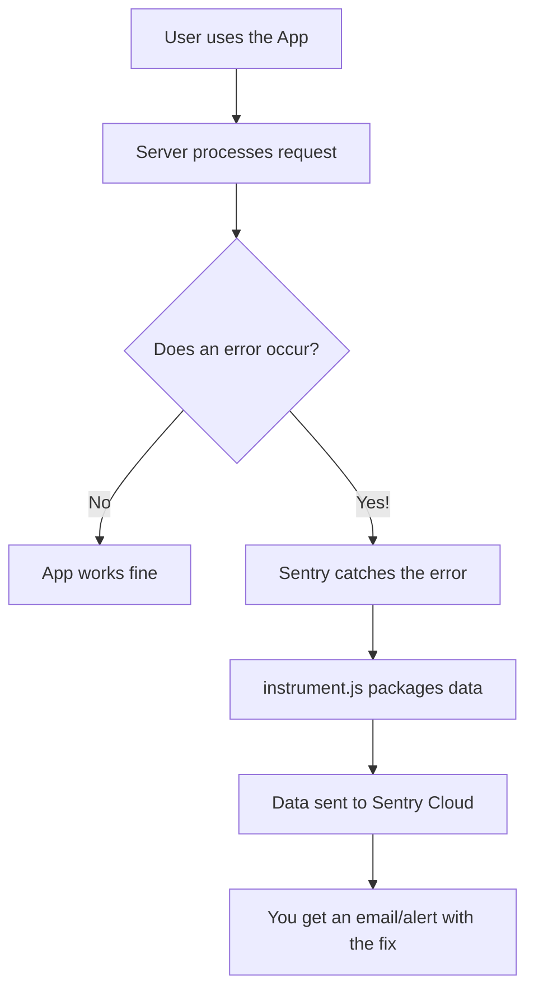

# Instrumentation (`instrument.js`) Explanation

This file is the **security camera** and **diagnostic tool** for your backend. It's responsible for setting up **Sentry**, which helps you monitor errors, crashes, and performance issues in real-time.

---

## 🏗️ Overall Purpose
Imagine your server is running 24/7. When an error happens, you usually don't see it until a user complains. This file "instruments" your code so that:
1.  Any **crash** is automatically reported to you.
2.  **Slow code** is identified.
3.  **Local variables** at the time of an error are captured to help you fix bugs faster.

---

## 🧩 Code Breakdown

### 1. Imports (Lines 1-2)
```javascript
import * as Sentry from "@sentry/node";
import { ENV } from "./src/config/env.js";
```
*   **`@sentry/node`**: The professional toolkit for monitoring Node.js apps.
*   **`ENV`**: Loads your sensitive configuration, specifically the `SENTRY_DSN` (Data Source Name), which tells the server *where* to send the reports.

### 2. Initialization (`Sentry.init`) (Lines 4-14)
This block starts the engine.

*   **`dsn`**: This is like a post office address. It's unique to your Sentry project.
*   **`tracesSampleRate: 1.0`**: "Traces" track how long requests take. `1.0` means it tracks **100%** of requests. (In a huge app, you might lower this to 0.1 to save costs).
*   **`profilesSampleRate: 1.0`**: "Profiling" looks deep into the CPU usage to see which function is slow. Again, set to **100%**.
*   **`environment`**: Tells Sentry if the error happened during "development" or on the live "production" site.
*   **`includeLocalVariables: true`**: This is a lifesaver for debugging. If a variable named `userEmail` caused a crash, Sentry will show you exactly what its value was at that moment.
*   **`sendDefaultPii: true`**: "PII" stands for Personally Identifiable Information. Setting this to `true` allows Sentry to capture the user's IP address, making it easier to see if errors are happening to specific people or locations.

---

## 🌊 How Error Tracking Works



---

## 🛠️ Summary of Key Technical Terms

| Term | Simple Meaning |
| :--- | :--- |
| **Instrumentation** | Adding code to "watch" and "measure" how your app performs. |
| **DSN** | The "Address" where error reports are sent. |
| **Sampling Rate** | The percentage of data you choose to record (1.0 = All). |
| **PII** | Data that can identify a specific person (like IP address). |
| **Profiling** | Monitoring how much computer power (CPU/RAM) your code uses. |

---

> [!TIP]
> This file is usually loaded **first** in your application (before even starting the server) to ensure it's "watching" from the very beginning.
