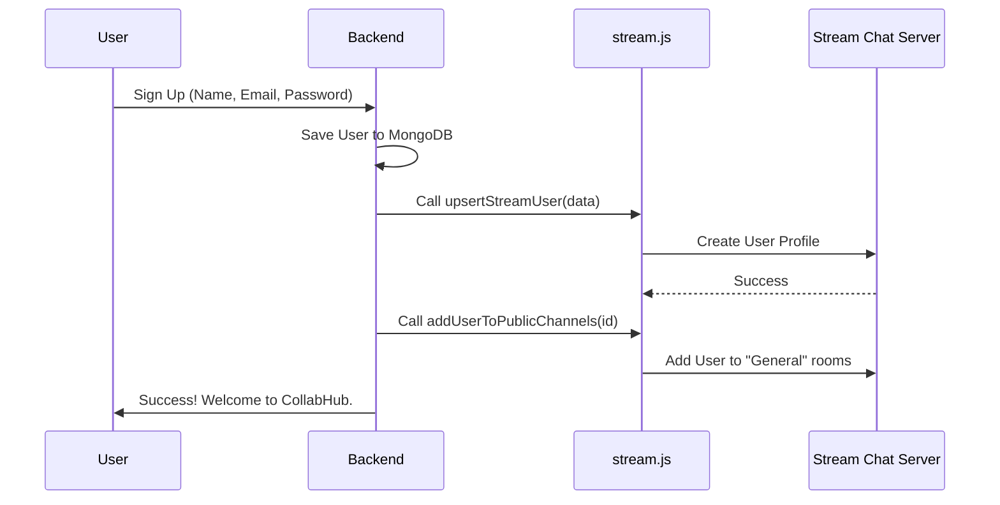
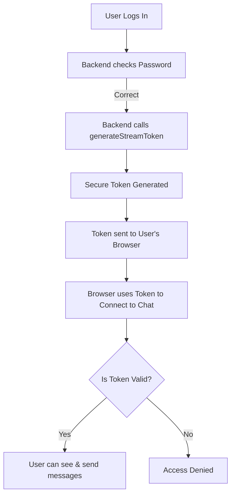

# Stream Configuration (`stream.js`) Explanation

This file is the **bridge** between your CollabHub backend and the **Stream Chat Service**. It manages how users are created, deleted, and authenticated for the real-time chat features of your application.

---

## 🏗️ Overall Purpose
When a user signs up or logs into CollabHub, they need a corresponding profile in the "Stream" database to send messages. This file contains helper functions that the backend uses to:
1. **Sync Users**: Keep Stream's user list updated with your database.
2. **Authorize Users**: Give users a "golden ticket" (token) to enter the chat.
3. **Automate Attendance**: Automatically add new users to public discussion rooms.

---

## 🧩 Code Breakdown

### 1. Imports and Setup (Lines 1-8)
```javascript
import { StreamChat } from "stream-chat";
import * as Sentry from "@sentry/node";
import { ENV } from "../config/env.js";

const streamClient = StreamChat.getInstance(ENV.STREAM_API_KEY, ENV.STREAM_API_SECRET);
```
*   **`StreamChat`**: The official library provided by Stream to talk to their servers.
*   **`Sentry`**: A tool that catches and reports errors if something goes wrong.
*   **`ENV`**: Your secret keys (API Key & Secret) stored safely in environment variables.
*   **`streamClient`**: This initializes the connection. Think of it as opening a "hotline" to Stream's servers.

---

### 2. User Synchronization (`upsertStreamUser`)
```javascript
export const upsertStreamUser = async (userData) => {
    try {
        await streamClient.upsertUser(userData);
        // ...
    } catch (error) { ... }
};
```
*   **What is "Upsert"?**: It's a combination of **Up**date + In**sert**. 
    *   If the user doesn't exist, it **creates** them.
    *   If the user already exists, it **updates** their info (like name or profile picture).
*   **When is it used?**: During user registration or when a user updates their profile.

---

### 3. User Removal (`deleteStreamUser`)
```javascript
export const deleteStreamUser = async (userId) => {
    try {
        await streamClient.deleteUser(userId);
        // ...
    } catch (error) { ... }
};
```
*   **Purpose**: Completely removes a user from the chat system.
*   **When is it used?**: If a user deletes their CollabHub account.

---

### 4. Security Token (`generateStreamToken`)
```javascript
export const generateStreamToken = (userId) => {
    return streamClient.createToken(userIdString);
};
```
*   **Purpose**: Stream doesn't trust the frontend to just "say" who they are. The backend must sign a **secure token** (like a digital signature) using the Secret Key.
*   **When is it used?**: Every time a user logs in. The frontend sends this token to Stream to prove their identity.

---

### 5. Auto-Joining Channels (`addUserToPublicChannels`)
```javascript
export const addUserToPublicChannels = async (newUserId) => {
    const publicChannels = await streamClient.queryChannels({ discoverable: true });
    await Promise.all(publicChannels.map(channel => channel.addMembers([newUserId])));
};
```
*   **Purpose**: Finds every channel marked as "discoverable" (public) and forces the new user into them.
*   **Benefit**: Users don't have to manually find and join the main chat rooms when they join the platform.

---

## 🌊 Flow Diagrams

### User Onboarding Flow
This diagram shows how `stream.js` functions interact during a new user signup.



### Authentication Flow (Token Generation)


---

## 🛠️ Summary Table

| Function | What it does? | Why is it needed? |
| :--- | :--- | :--- |
| `upsertStreamUser` | Creates or Updates a user profile. | To make sure the chat system knows the user exists. |
| `deleteStreamUser` | Deletes a user profile. | To keep data clean when a user leaves the platform. |
| `generateStreamToken` | Signs a security token. | For secure, password-less authentication on the frontend. |
| `addUserToPublicChannels`| Joins user to all public rooms. | To give users an immediate "populated" experience. |
