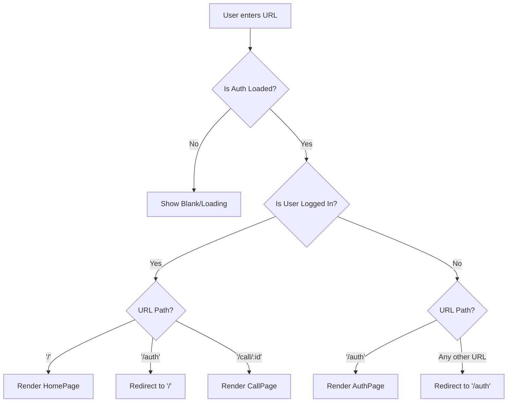

# Application Main Router (`App.jsx`) Explanation

This file is the **Traffic Controller** (or Brain) of your frontend. It decides what a user sees based on two things:
1.  What **URL** they are visiting (e.g., `/`, `/auth`, or `/call/123`).
2.  Whether they are **Logged In** or not.

---

## 🏗️ Overall Purpose
The `App.jsx` file sets up the **Routing** (navigation system) and the **Authentication Guard**. It ensures that:
-   Unauthenticated users are sent to the **Login Page**.
-   Authenticated users stay on the **Home Page**.
-   Every page "hop" is tracked by **Sentry** for performance monitoring.

---

## 🧩 Code Breakdown

### 1. The Tools (Imports)
-   **`useAuth` (Clerk)**: The tool that tells us "Is this user logged in?".
-   **`Navigate, Route, Routes`**: The standard navigation tools for React.
-   **`Sentry`**: Wraps the routes so you can see exactly how long it takes for a user to move from one page to another.

### 2. Sentry Integration (Line 10)
```javascript
const SentryRoutes = Sentry.withSentryReactRouterV7Routing(Routes);
```
*   This creates a "Superpower" version of the standard `Routes` component. It automatically records how pages load and helps you find bottlenecks in your app.

### 3. The Authentication Check (Lines 13-15)
```javascript
const { isSignedIn, isLoaded } = useAuth();
if (!isLoaded) return null;
```
*   **`isLoaded`**: We wait for Clerk to finish checking the user's cookies. If we don't wait, the app might accidentally show the login page for a split second even if the user is already logged in (this is called "flickering").
*   **`isSignedIn`**: A simple `true` or `false` that tells us if the user is logged in.

### 4. Route Logic (Gatekeeping)
-   **Home (`/`)**: If `isSignedIn` is true, show `HomePage`. If not, kick them back to `/auth`.
-   **Auth (`/auth`)**: If the user is already logged in, they shouldn't be here! Redirect them to the Home Page (`/`).
-   **Calls (`/call/:id`)**: Specifically protects the video call room.
-   **Fallback (`*`)**: Handles the "404 Not Found" logic by redirecting users to the most appropriate place based on their login status.

---

## 🌊 Navigation Flow Chart

This diagram shows how `App.jsx` decides what to render when a user enters the site.



---

## 🛠️ Summary Table

| Block | Simple Meaning | Why is it needed? |
| :--- | :--- | :--- |
| `useAuth()` | The "Identity Badge" checker. | To know if the user is a guest or a member. |
| `Navigate` | The "Door" that pushes you elsewhere. | To force users to log in before seeing content. |
| `SentryRoutes` | The "Stopwatch" on your routes. | To catch slow page transitions and errors. |
| `:id` (in path) | A "Placeholder" variable. | Allows one page to handle many different call rooms. |

---

> [!IMPORTANT]
> Because of this file, you can never "hack" your way into the Home Page just by typing the URL; the `isSignedIn` check is the ultimate gatekeeper.
