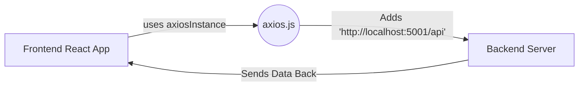

# Understanding the Axios Instance (`axios.js`)

In web development, we often need to talk to a **Backend** (the server) to get or save data. The `axios.js` file is like a pre-configured "cell phone" that is already programmed with the backend's phone number and settings.

---

## 🏗️ High-Level Concept

Instead of typing out the full backend URL every time we want to make a request, we use this **Axios Instance**. It acts as a central hub for all our communication.



---

## 🔍 Code Block Breakdown

### 1. Importing the Tool
```javascript
import axios from "axios";
```
- **What is Axios?** Axios is a popular library that makes it very easy for browsers to send "HTTP requests" (like GET or POST) to servers.

### 2. Identifying the Backend Address
```javascript
const BASE_URL = import.meta.env.VITE_BACKEND_URL || "http://localhost:5001/api";
```
- **`import.meta.env`**: This is how we look at our "Secret Settings" file (`.env`). In a real project, the backend address changes (e.g., from `localhost` to `myapp.com`). This line automatically picks the right one.
- **`|| "http://localhost:5001/api"`**: This is a fallback. If the secret settings are missing, it defaults to your local computer's address.

### 3. Creating the "Instance"
```javascript
export const axiosInstance = axios.create({
  baseURL: BASE_URL,
  withCredentials: true,
});
```
- **`axios.create({})`**: This creates a custom version of Axios with our specific rules.
- **`baseURL`**: This ensures that every request we make starts with the address we defined above. If we ask for `/users`, Axios knows it actually means `http://localhost:5001/api/users`.
- **`withCredentials: true`**: This is a security setting. It tells the browser, "Hey, if we have any secret cookies or session keys, send them along with the request." This is essential for keeping users logged in.

---

## 🚀 Why do we use this?

1.  **Cleaner Code**: You don't have to type `http://localhost:5001/api` forty different times.
2.  **Easy Maintenance**: If your backend port changes from `5001` to `6000`, you only change it in **one** place (the `.env` file), and the whole app updates instantly.
3.  **Consistency**: Every request follows the same rules (like `withCredentials`), ensuring fewer bugs.

---

## 📖 How to use it in other files?

Instead of using the default axios, you just import this instance:

```javascript
import { axiosInstance } from "../lib/axios";

// This will automatically call: http://localhost:5001/api/profile
const response = await axiosInstance.get("/profile");
```
