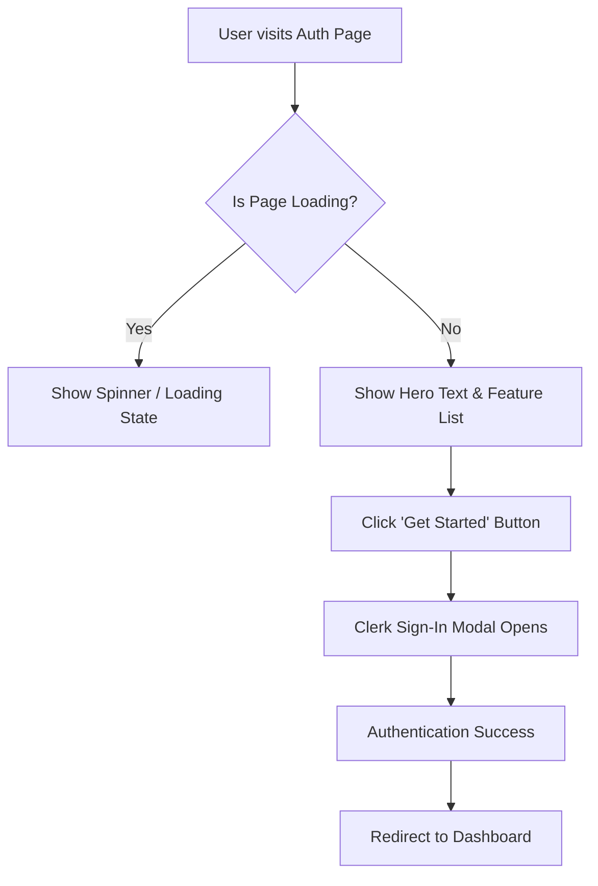

# Understanding the Auth Page (`AuthPage.jsx`)

The **Auth Page** is the "front door" of CollabHub. It's the first thing users see when they aren't logged in. Its job is to welcome users, explain what the app does, and provide a secure way to sign in.

---

## 🏗️ High-Level Architecture

The page is designed with a **Two-Column Layout**:
1.  **Left Side (Hero & Action)**: Contains the branding, value proposition, and the "Sign In" trigger.
2.  **Right Side (Visual)**: A decorative image that reinforces the "collaboration" theme.



---

## 🔍 Code Block Breakdown

### 1. State Management
```javascript
const [isLoading, setIsLoading] = useState(true);
const [error, setError] = useState(null);
```
- **`isLoading`**: This keeps track of whether the page is "thinking." We start it as `true` to show a smooth entrance animation.
- **`error`**: This stores any error messages (like connection issues) so we can show them to the user.

### 2. Entrance Animation (useEffect)
```javascript
useEffect(() => {
  const timer = setTimeout(() => {
    setIsLoading(false);
  }, 1500);
  return () => clearTimeout(timer);
}, []);
```
- **Purpose**: When the page first loads, we wait 1.5 seconds before "revealing" the content. This prevents the page from flickering and allows the user to see the premium entrance animations.

### 3. The "Get Started" Action
```javascript
const handleSignIn = () => {
  setIsLoading(true);
  setTimeout(() => {
    setIsLoading(false);
    setError("Unable to connect. Please try again.");
  }, 2000);
};
```
- **Purpose**: This function runs when the user clicks the main button. In a real app, it signals that the auth process is starting. Here, we use it to show a "Signing in..." spinner.

### 4. Clerk Integration
```javascript
<SignInButton mode="modal" forceRedirectUrl="/">
  <button className={`cta-button ${isLoading ? "loading" : ""}`} ...>
    {/* Button Content */}
  </button>
</SignInButton>
```
- **`SignInButton`**: This is a powerhouse component from **Clerk**. Instead of us building complex login forms, we wrap our button in this. 
- **Wait, what does it do?** When clicked, Clerk automatically pops up a beautiful, secure login window. Once the user logs in, it sends them back to the main page (`/`).

---

## ✨ Key UI Components

### 🌟 Feature List
We use a simple list to quickly tell the user why they should use CollabHub:
- 💬 **Real-time messaging**
- 🎥 **Video calls**
- 🔒 **Secure & private**

### ⚠️ Error Handling
If something goes wrong (like a network error), we show a dismissible alert:
```javascript
{error && (
  <div className="error-message">
    <span>{error}</span>
    <button onClick={() => setError(null)}>✕</button>
  </div>
)}
```
- **Logic**: If `error` has text in it, the box appears. If the user clicks the `X`, it sets `error` back to `null`, and the box vanishes.

---

## 🎨 Design Philosophy
- **Glassmorphism**: We use subtle transparencies and blurs (defined in `auth.css`) to make the UI feel modern and deep.
- **Aesthetics**: The use of emojis and vibrant colors makes the platform feel friendly and "alive."
- **Micro-interactions**: The button pulses, and elements slide into place, guiding the user's eye toward the "Get Started" action.
