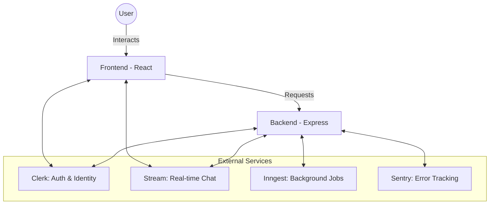

# 🏛️ Stage 1: The Big Picture (Architecture)

To master this project, you must first understand how the different "gears" of the machine fit together. This is a **Modern Fullstack Architecture**.

---

## 1. The Core Split: Frontend vs. Backend

Think of the project as a **Restaurant**:

*   **Frontend (The Dining Area)**: Built with **React + Vite**. This is where the user sits, looks at the menu (UI), and places orders (clicks buttons).
*   **Backend (The Kitchen)**: Built with **Node.js + Express**. This is where the cooking happens—checking permissions, talking to the database, and managing security.

### 🧩 Mapping the Folders
| Folder | Role | Key File |
| :--- | :--- | :--- |
| `frontend/src` | The visual interface and user logic. | `main.jsx` (The entry point) |
| `backend/src` | The brain and security hub. | `server.js` (The main engine) |

---

## 2. The "Magnificent Four" (External Services)

Instead of building everything from scratch (which takes years), we use professional services. This is a **pro-level architectural decision** that saves time and increases security.

### Why these?
1.  **Clerk**: Manages passwords, emails, and sessions. If a hacker attacks, Clerk's multi-million dollar security team handles it, not you.
2.  **Stream Chat**: Building a chat that doesn't lag is hard. Stream gives us the "WhatsApp-like" speed out of the box.
3.  **Inngest**: Handles slow tasks in the background so the user doesn't see a "Loading..." spinner forever.
4.  **Sentry**: Our "Black Box Recorder." If the app crashes, Sentry tells us exactly which line of code failed.

---

## 3. The Communication Bridge (API & Security)

How does the Frontend talk to the Backend without getting hacked?

### The "Security Badge" Flow
1.  **Login**: User logs in via Clerk on the Frontend.
2.  **The Badge**: Clerk gives the Frontend a **Session Token** (a unique code).
3.  **The Request**: When the Frontend asks the Backend for chat data, it attaches this token in the header.
4.  **The Check**: The Backend uses `clerkMiddleware()` (in `server.js`) to see if that badge is valid.

### Centralized Config (`env.js`)
We never put secret passwords in our code. We use `backend/src/config/env.js` to load them from a hidden `.env` file. 
> **Professor Tip**: Tell them this follows the **"Twelve-Factor App"** methodology for secure configuration.

---

## 4. The Boot Flow (Turning it on)

When you run `npm run dev`, your app follows a strict sequence:

### Backend Startup Sequence
1.  **Instrumentation**: `instrument.js` loads first to "watch" for errors.
2.  **Middlewares**: Express prepares to handle JSON and Cross-Origin (CORS) requests.
3.  **Database**: We connect to **MongoDB Atlas**.
4.  **Routes**: We tell the server which URLs it should listen to (e.g., `/api/chat`).

### Frontend Startup Sequence
1.  **Sentry Init**: Starts tracking user clicks and errors.
2.  **AuthProvider**: Wraps the whole app to manage the user's login state globally.
3.  **Router**: Decides which page to show (Home vs. Auth).

---

## 💡 Example: Sending a Message
If a user sends a message, it doesn't just "appear."
1.  **Frontend**: User types and hits enter.
2.  **Stream SDK**: Sends the message directly to Stream's servers.
3.  **Real-time Update**: Stream tells everyone else in that room, "Hey, there's a new message!"
4.  **Sync**: Our Backend might later receive a notification to log that message or run a filter.

---

> [!NOTE]
> This architecture is designed for **Scalability**. If tomorrow you have 1,000,000 users, you can simply upgrade your service plans without rewriting your entire code.
